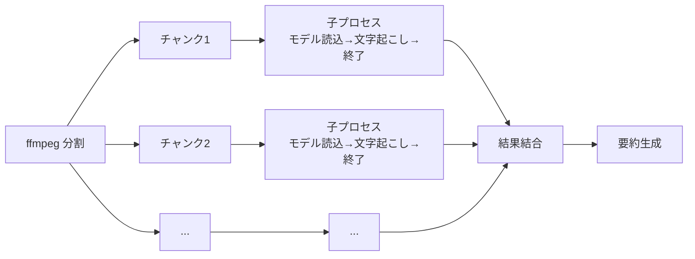
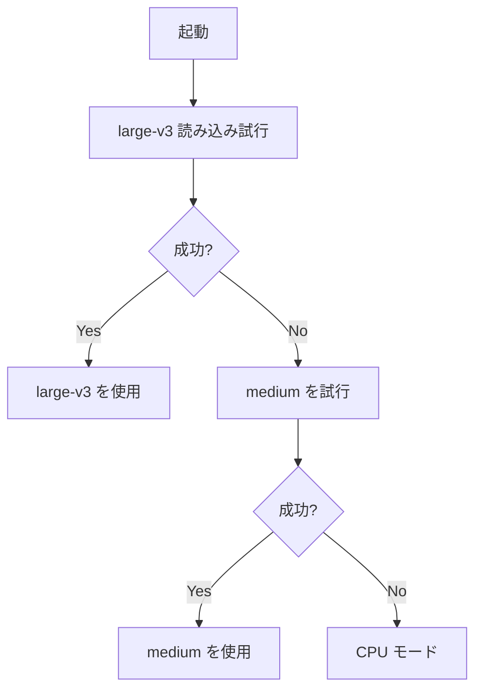
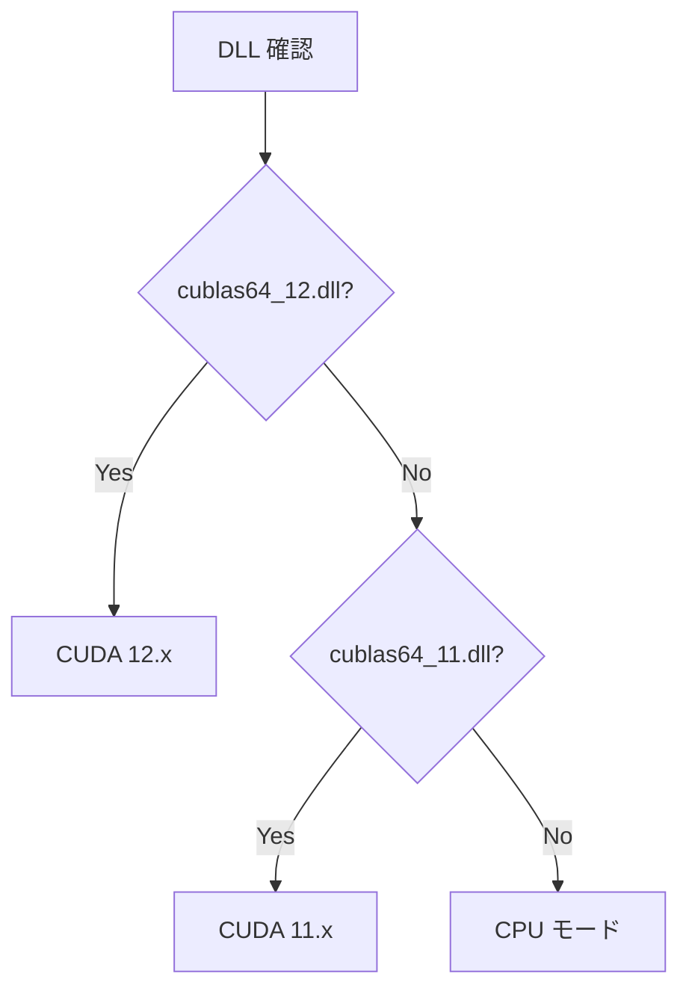
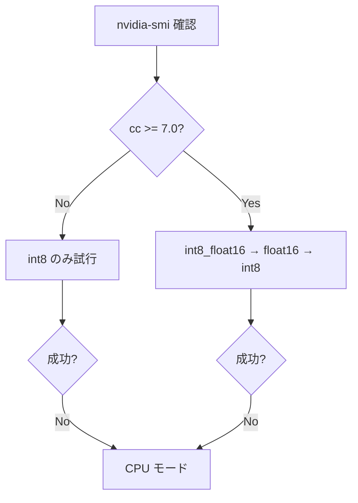

# Video Summarizer (動画要約ツール)

ローカルPC上の動画ファイルの内容をテキストに要約する無料システム。  
GPU の性能に応じて自動的に最適な設定を選択します。

## 仕組み

```mermaid
flowchart TD
    A[動画ファイル<br/>mp4 / avi / mkv / mov] --> B[ffmpeg<br/>音声抽出]
    B --> C[WAV<br/>16kHz モノラル]
    C --> D[faster-whisper<br/>文字起こし]
    D --> E[文字起こし全文<br/>タイムスタンプ付き]
    E --> F[TextRank (janome)<br/>抽出型要約]
    F --> G[出力: *_summary.txt]
```

大規模な動画は**2分ごとのチャンクに分割**し、各チャンクを独立した子プロセスで処理することで VRAM を確実に解放します。



## 自動選択機能

このツールは実行環境を自動検出し、最適な設定に調整します。

### モデルサイズ自動フォールバック



### CUDA バージョン自動検出



### Compute Capability 判定



## インストール

### 自動セットアップ（推奨）

```powershell
cd transrateText
.\setup.ps1
```

GPU の種類を自動検出し、適切な ctranslate2 + faster-whisper バージョンをインストールします。

### 手動セットアップ

**ffmpeg:**
```powershell
winget install ffmpeg
```

**Python パッケージ:**
```powershell
pip install faster-whisper janome
```

GPU の世代によって ctranslate2 のバージョンが異なります。`setup.ps1` が自動判定します。

## 使い方

```powershell
python video_summarizer.py
```

GUI が開くので「ファイルを選択」→「実行開始」で動画を選ぶだけ。  
動画と同じフォルダに `[ファイル名]_summary.txt` が出力されます。

### 出力例

```
============================================================
文字起こし全文
============================================================

[00:00 -> 00:12] ...
[00:12 -> 00:25] ...

============================================================
要約
============================================================

(TextRank で抽出された重要文)
```

## 処理フロー詳細

### 実行時のログ例（30分動画・GTX 1050 Ti）

```
[0/3] 最適なモデルサイズを選定中...
   モデル large-v3 の利用可否を確認中...
   large-v3 は利用不可 → 次サイズにフォールバック
   モデル medium の利用可否を確認中...
   モデル選定: medium を使用します
[1/3] ffmpeg で音声分割開始（モデル: medium）
   チャンク 1: 0分〜2分
   チャンク 2: 2分〜4分
   ...（全15チャンク）...
   15 チャンクに分割完了
[2/3] faster-whisper で文字起こし開始（beam_size=1, vad_filter=True）
   文字起こし処理中...（3分経過）
   チャンク 1/15 (0分〜) 処理中...
     演算ユニット: CUDA 11.x
     compute_type 試行順: ['int8']
     compute_type = int8 を試行...
     検出言語: ja (確度: 1.00)
   チャンク 2/15 (2分〜) 処理中...
     演算ユニット: CUDA 11.x
     ...
   文字起こし完了
[3/3] TextRank で要約生成開始
[3/3] 要約生成完了
--- 保存完了: [ファイル名]_summary.txt
```

## 技術スタック（すべて無料・ローカル完結）

| 機能 | ツール | 備考 |
|------|--------|------|
| 音声抽出 | ffmpeg | あらゆる動画形式対応 |
| 音声認識 | faster-whisper | GPU / CPU 自動切替。子プロセス管理で VRAM 解放 |
| モデル自動選択 | — | large-v3 → medium の自動フォールバック |
| CUDA 判定 | ctypes | DLL 有無で CUDA 12 / 11 / CPU を自動判別 |
| 言語解析 | janome | 日本語形態素解析 (純Python) |
| 要約 | TextRank | 教師なしグラフベースの抽出型要約。学習不要 |
| GUI | tkinter | Python標準。追加インストール不要 |

## 仕様詳細

### チャンク分割

| 項目 | 値 |
|------|-----|
| チャンクサイズ | 120秒（2分） |
| 方式 | ffmpeg で音声のみ抽出、16kHz モノラル WAV |
| VRAM 管理 | 各チャンクを独立した子プロセスで処理。プロセス終了時に VRAM 完全解放 |
| オーバーヘッド | 1チャンクあたり約45秒（モデル読込 + Python 起動） |

### 使用モデル

| モデル | パラメータ数 | サイズ | VRAM目安 | 備考 |
|--------|------------|--------|---------|------|
| tiny | 39M | 75MB | 〜1GB | 低精度・最速 |
| base | 74M | 150MB | 〜1GB | やや低精度 |
| small | 244M | 500MB | 〜2GB | 中精度・実用的 |
| medium | 769M | 1.5GB | 〜3GB | 高精度・バランス良 |
| large-v3 | 1,550M | 3GB | 〜4GB | 最高精度・VRAM 要潤沢 |

起動時に large-v3 から試行し、OOM となった場合は medium に自動フォールバックします。

### GPU 判定ロジック

1. `cublas64_12.dll` の有無 → CUDA 12.x
2. `cublas64_11.dll` の有無 → CUDA 11.x
3. どちらもなし → CPU
4. CUDA 検出時は nvidia-smi で compute capability を確認:
   - cc >= 7.0（RTX 20/30/40/50 系）: int8_float16 → float16 → int8
   - cc < 7.0（GTX 10/16 系）: int8 のみ

### プログレスモニター

文字起こし中は3分おきに経過時間を表示:

```
文字起こし処理中...（3分経過）
文字起こし処理中...（6分経過）
文字起こし処理中...（9分経過）
```

## ファイル構成

| ファイル | 役割 |
|---------|------|
| `video_summarizer.py` | メインアプリケーション (GUI + パイプライン制御) |
| `_transcribe_worker.py` | 文字起こしワーカー（各チャンク用子プロセス） |
| `setup.ps1` | 自動セットアップスクリプト（環境検出 + パッケージインストール） |
| `models/` | Whisper モデルキャッシュディレクトリ |
| `README.md` | このファイル |

## トラブルシューティング

### `WinError 1314`（シンボリックリンク作成権限不足）

自動設定済み: `HF_HUB_DISABLE_SYMLINKS=1`

### CUDA out of memory

自動フォールバック機能により large-v3 → medium → CPU と段階的に縮退します。  
手動で強制する場合は `video_summarizer.py` 先頭の `WHISPER_MODEL_SIZE` を変更:

```python
WHISPER_MODEL_SIZE = "small"   # 軽量モデルに変更
```

### 環境構成の不一致

起動時に `_check_environment()` が自動検出し、ctranslate2 のバージョンと利用可能な CUDA DLL に不一致があれば警告を表示します。`setup.ps1` を実行すると最適な構成に修正されます。

### VRAM 不足（4GB GPU）

- ブラウザ（Edge/Chrome）や Office アプリを終了して VRAM を解放
- 自動チャンク分割（2分）＋子プロセス方式で VRAM フラグメンテーションを防止
- モデルサイズを medium / small に変更

## PCスペックと処理時間の関係

### GPU と処理時間の早見表（30分動画基準）

| GPU | VRAM | 使用モデル | 所要時間目安 |
|-----|------|-----------|------------|
| なし (CPU) | — | small | 30〜60分 |
| GTX 1050 Ti (Pascal) | 4GB | medium (int8) | 10〜20分 |
| RTX 3060 (Ampere) | 12GB | large-v3 (int8_float16) | 3〜5分 |
| RTX 4090 (Ada) | 24GB | large-v3 (int8_float16) | 1〜2分 |

### 動画の長さごとの推奨スペック

| 動画時間 | 最小スペック | 推奨スペック |
|----------|------------|------------|
| 〜15分 | CPU 4コア, RAM 4GB | GPU 4GB VRAM, RAM 8GB |
| 15〜60分 | GPU 4GB VRAM, RAM 8GB | GPU 6GB+ VRAM, RAM 16GB |
| 1〜3時間 | GPU 6GB VRAM, RAM 16GB | GPU 8GB+ VRAM, RAM 16GB+ |
| 3時間〜 | GPU 8GB+ VRAM, RAM 16GB+ | GPU 12GB+ VRAM, RAM 32GB |
